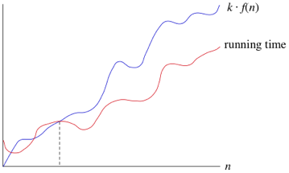
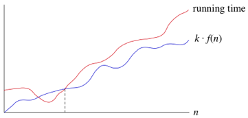
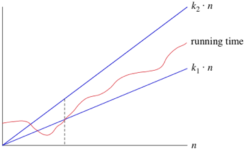
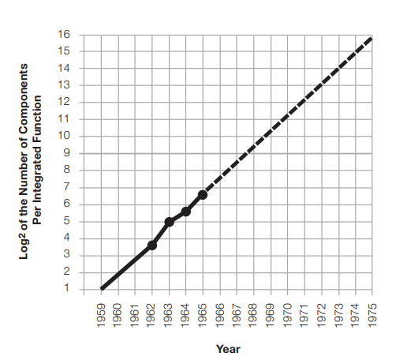

# Binary Algorithm Project
## MAT 275 | 2021.08.03
### Moustafa Habra
---

## Part 1

I wrote a program in C++ for this project. Check out the source code 
Running main program with steps, with an input of 14 and 3:

~~~
1. Run main program (input decimal numbers, which are converted to binary, and then divided)
2. Convert number into binary
3. Subtract two binary numbers
4. Divide (find div and mod) of two binary numbers

Enter choice: 1

Running main program:
Enter first number (dividend): 14
Enter second number (divisor): 3
Do you wish to print steps? Enter 'y' for yes or 'n' for no: y
Converting 14 to binary:

14 NOT EQUAL to 0
Remainder = 14 mod 2 = 0
New quotient = 14 div 2 = 7

7 NOT EQUAL to 0
Remainder = 7 mod 2 = 1
New quotient = 7 div 2 = 3

3 NOT EQUAL to 0
Remainder = 3 mod 2 = 1
New quotient = 3 div 2 = 1

1 NOT EQUAL to 0
Remainder = 1 mod 2 = 1
New quotient = 1 div 2 = 0

14 in binary is 1110

Converting 3 to binary:

3 NOT EQUAL to 0
Remainder = 3 mod 2 = 1
New quotient = 3 div 2 = 1

1 NOT EQUAL to 0
Remainder = 1 mod 2 = 1
New quotient = 1 div 2 = 0

3 in binary is 11

Dividing 1110 by 11 using repeated subtraction:
1110 -
0011

Right now borrow is: 0
0 < (1 + 0)
Thus digit of answer is: 0 + 2 - 1 - 0 =    1
Borrow becomes 1

Right now borrow is: 1
1 < (1 + 1)
Thus digit of answer is: 1 + 2 - 1 - 1 =    1
Borrow becomes 1

Right now borrow is: 1
1 >= (0 + 1)
Thus digit of answer is: 1 - 0 - 1 =    0
Borrow becomes 0

Right now borrow is: 0
1 >= (0 + 0)
Thus digit of answer is: 1 - 0 - 0 =    1
Borrow becomes 0

1110 - 0011 in binary will be all of the digits: 1011

Having subtracted 1 times:
1110 - 11 = 1011 is greater than 11, so we subtract again

1011 -
0011

Right now borrow is: 0
1 >= (1 + 0)
Thus digit of answer is: 1 - 1 - 0 =    0
Borrow becomes 0

Right now borrow is: 0
1 >= (1 + 0)
Thus digit of answer is: 1 - 1 - 0 =    0
Borrow becomes 0

Right now borrow is: 0
0 >= (0 + 0)
Thus digit of answer is: 0 - 0 - 0 =    0
Borrow becomes 0

Right now borrow is: 0
1 >= (0 + 0)
Thus digit of answer is: 1 - 0 - 0 =    1
Borrow becomes 0

1011 - 0011 in binary will be all of the digits: 1000

Having subtracted 2 times:
1011 - 11 = 1000 is greater than 11, so we subtract again

1000 -
0011

Right now borrow is: 0
0 < (1 + 0)
Thus digit of answer is: 0 + 2 - 1 - 0 =    1
Borrow becomes 1

Right now borrow is: 1
0 < (1 + 1)
Thus digit of answer is: 0 + 2 - 1 - 1 =    0
Borrow becomes 1

Right now borrow is: 1
0 < (0 + 1)
Thus digit of answer is: 0 + 2 - 0 - 1 =    1
Borrow becomes 1

Right now borrow is: 1
1 >= (0 + 1)
Thus digit of answer is: 1 - 0 - 1 =    0
Borrow becomes 0

1000 - 0011 in binary will be all of the digits: 0101

Having subtracted 3 times:
1000 - 11 = 101 is greater than 11, so we subtract again

101 -
011

Right now borrow is: 0
1 >= (1 + 0)
Thus digit of answer is: 1 - 1 - 0 =    0
Borrow becomes 0

Right now borrow is: 0
0 < (1 + 0)
Thus digit of answer is: 0 + 2 - 1 - 0 =    1
Borrow becomes 1

Right now borrow is: 1
1 >= (0 + 1)
Thus digit of answer is: 1 - 0 - 1 =    0
Borrow becomes 0

101 - 011 in binary will be all of the digits: 010

Having subtracted 4 times:
101 - 11 = 10 is less than 11. We do not subtract again. This makes 10 our remainder (mod).
We subtracted 4 times. Thus, our binary quotient is 100

The div (quotient) of 1110 / 11 in binary is 100
The mod (remainder) is 10
~~~

## Part 2

My Hawk ID: 0888070  
0888070 % 7 = 1

Thus I did questions 2 and 7

### Question 2

>Look up Bachmann’s original introduction of big-O notation. Explain how he and others have used this notation.

Algorithms provide a step-by-step and logical way of approaching a problem. Using them, seemingly complex problems can be broken down into smaller steps and analysed. However, not at all algorithms are created the same. The number of operations an algorithm must do to achieve an answer can vary greatly depending on the type of algorithm, the steps that it uses, and even the number of inputs the algorithm takes in. Thus, it would be beneficial if there was a way to compare algorithms based on the number of operations they need to complete a problem.

In 1894, a German mathematician by the name of Paul Bachmann, devised Big-O notation, in a his book titled *Analytische Zahlentheori* (Nasar, 2016). Bachmann used Big-O notation to denote an upper limit for the number of operations that algorithm needs to find an answer. Formally, he gave the definition of big-O as a function $f(x)$ is $O(g(x))$, when: $|f(x)| ≤ C|g(x)|, \text{whenever } x > k$ (Rosen, 2019). Basically this means a function is big-O of another function $g(x)$, if $g(x)$ is greater or equal than it, while multiplied by some constant $C$, after some point $k$. A visualization of Big-O can be shown like this:  
 (Rosen, 2019)

For example, if an algorithm takes $n$ input, and does $n$ operations to find the answer, it is $O(n)$. However, this algorithm is also $O(n^2)$ and $O(n^3)$, and many other different functions. This is because big-O notation only prescribes an *upper limit* to algorithms and functions. Since an algorithm that has linear complexity is smaller than $n^2$ and $n^3$, it is both $O(n^2)$ and $O(n^3)$. However, it is not always useful to call it as such, because it does not give relevant information.

Bachmann's original definition of Big-O only meant this: an upper-limit for an algorithm (Nasar, 2016). But over time, people started using it incorrectly as meaning both an upper limit and lower limit of growth (Nasar, 2016). In 1976, prominent mathematician and computer scientist Donald Knuth, further defined big-Omega, and big-Theta notations (Nasar, 2016). Big-Omega defined a lower limit for algorithms, with $f(x)$ being $Ω(g(x))$ if there are constants C and k with C positive such that $|f (x)| ≥ C|g(x)|$ whenever $x > k$ (Rosen, 2019). Big-Theta defined a lower and upper limit for algorithms, with $f(x)$ being $Θ(g(x))$ if $C_1|g(x)| ≤ | f (x)| ≤ C_2|g(x)|$, with $C_1$ and $C_2$ being arbitrary constants. Thus, if $f(x)$ is both $O(g(x))$ and $Ω(g(x))$, then it is $Θ(g(x))$ (Rosen, 2019). 

Big-Omega: (Rosen, 2019) 

Big-Theta: (Rosen, 2019)

With the development of these new notations, the use of big-O to mean big-Theta has decreased, but is still sometimes used (Rosen, 2019).

### Question 7
>Describe the historic trends in how quickly processors can perform operations and use these trends to estimate how quickly processors will be able to perform operations in the next 20 years.

Processing power has always been a piece of technology that computer and electrical engineers have tried to improve. The more powerful and more efficient processors become, the cheaper computers become and the greater the advancements in computer science. In the mid-20th century, electronic circuits were improving at an astonishing rate (Markoff, 2015). Every few years, more and more breakthroughs would occur in the field. Computer scientists at the time theorized about the future of computer production scaling; that is to say, the mass production of computer parts with dramatically better quality at very cheap rates (Markoff, 2015). One of the most famous of these scaling predictions was Moore's law.

Gordon Moore was a scientist who lived at the time of ever-improving transistors. Looking at transistor improvements around him, Moore theorized that the number of transistors that could be placed on an integrated circuit would double every two years (Markoff, 2015). He theorized that this would be the case due to reduction in chip size, and less heat lost by the chips themselves. It's important to note that Moore's law is not actually a physical law, but mainly an extrapolation.  

(Moore, 1965)  

For decades, Moore's law held true. Circuits became smaller and smaller, yet held much more transistors and became much cheaper. These new, cheap, and fast circuits allowed for the boom of personal computers, and ultimately the growth of the Internet and the prevalence of computers in all aspects of daily life. Moore himself, theorized this in his original article about Moore's Law: "Integrated circuits will lead to such wonders as home computers or at least terminals connected to a central computer automatic controls for automobiles, and personal portable communications equipment" (Moore, 1965).  

However, it seems that Moore's law may be starting to plateau (Markoff, 2015). Transistors have gotten so small, that they have started to approach physical barriers that are hard to overcome. While scientists now have found clever ways of bypassing these difficulties, it may be harder and harder to do so in the future (Markoff, 2015). In the next 20 years, Moore's law may still continue to hold, but the time it takes for transistors to double might take 2.5 or 3 years. Circuit technology has by no means reached its end. However, the ubiquity of Moore's law's stability may be coming to an end.

### References

Markoff, J. (2015, September 26). *Smaller, Faster, Cheaper, Over: The Future of Computer Chips*. NYTimes. https://www.nytimes.com/2015/09/27/technology/smaller-faster-cheaper-over-the-future-of-computer-chips.html  
Moore, G. E. (1965). Cramming more components onto integrated circuits. *Electronics*, *38*(8).  
Nasar, A. A. (2016). The history of Algorithmic complexity. *The Mathematics Enthusiast*, *13*(3), 217-242.  
Rosen, K. H. (2019). *Discrete Mathematics and its Applications*. McGraw-Hill Education.
