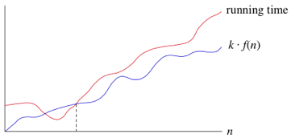

## Part 2

Hawk ID: 0888070  
0888070 % 7 = 1

Must do questions 2 and 7

### Question 2

>Look up Bachmann’s original introduction of big-O notation. Explain how he and others have used this notation.

Algorithms provide a step-by-step and logical way of approaching a problem. Using them, seemingly complex problems can be broken down into smaller steps and analysed. However, not at all algorithms are created the same. The number of operations an algorithm must do to achieve an answer can vary greatly depending on the type of algorithm, the steps that it uses, and even the number of inputs the algorithm takes in. Thus, it would be beneficial if there was a way to compare algorithms based on the number of operations they need to complete a problem.

In 1894, a German mathematician by the name of Paul Bachmann, devised Big-O notation, in a his book titled *Analytische Zahlentheori*. Bachmann used Big-O notation to denote an upper limit for the number of operations that algorithm needs to find an answer. Formally, he gave the definition of big-O as a function $f(x)$ is $O(g(x))$, when: $|f(x)| ≤ C|g(x)|, \text{whenever } x > k$. Basically this means a function is big-O of another function $g(x)$, if $g(x)$ is greater or equal than it, while multiplied by some constant $C$, after some point $k$. A visualization of Big-O can be shown like this:  

For example, if an algorithm takes $n$ input, and does $n$ operations to find the answer, it is $O(n)$. However, this algorithm is also $O(n^2)$ and $O(n^3)$, and many other different functions. This is because big-O notation only prescribes an *upper limit* to algorithms and functions. Since an algorithm that has linear complexity is smaller than $n^2$ and $n^3$, it is both $O(n^2)$ and $O(n^3)$. However, it is not always useful to call it as such, because it does not give relevant information.

Bachmann's original definition of Big-O only meant this: an upper-limit for an algorithm. But over time, people started using it incorrectly as meaning both an upper limit and lower limit of growth. In 1976, prominent mathematician and computer scientist Donald Knuth, further defined big-Omega, and big-Theta notations. Big-Omega defined a lower limit for algorithms, with $f(x)$ being $Ω(g(x))$ if there are constants C and k with C positive such that $|f (x)| ≥ C|g(x)|$ whenever $x > k$. Big-Theta defined a lower and upper limit for algorithms, with $f(x)$ being $Θ(g(x))$ if $C_1|g(x)| ≤ | f (x)| ≤ C_2|g(x)|$. Thus, if $f(x)$ is both $O(g(x))$ and $Ω(g(x))$, then it is $Θ(g(x))$. 

Big-Omega:  

Big-Theta: 

With the development of these new notations, the use of big-O to mean big-Theta has decreased, but is still sometimes used.

## Question 7
